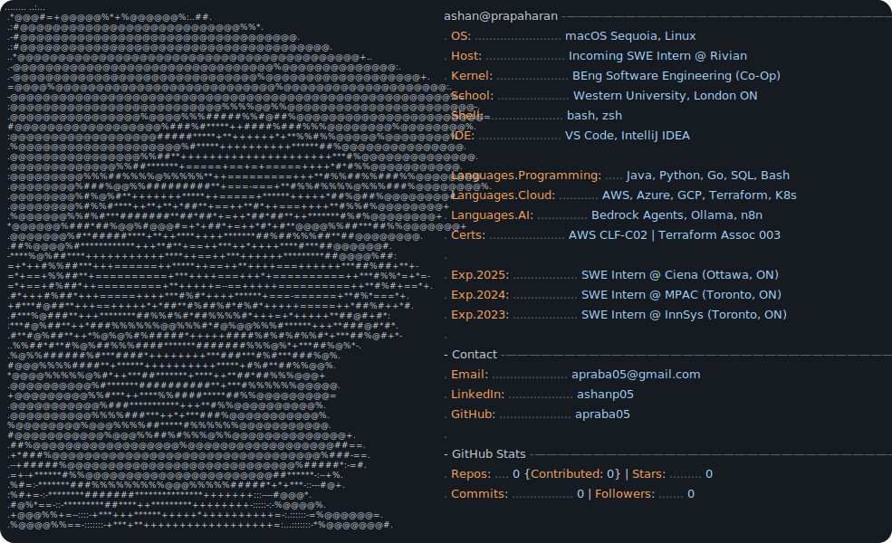

<picture>
  <source media="(prefers-color-scheme: dark)"  srcset="dark_mode.svg">
  <source media="(prefers-color-scheme: light)" srcset="light_mode.svg">
  
</picture>

 

<picture>
  <source media="(prefers-color-scheme: dark)"  srcset="https://raw.githubusercontent.com/apraba05/apraba05/output/github-contribution-grid-snake-dark.svg">
  <source media="(prefers-color-scheme: light)" srcset="https://raw.githubusercontent.com/apraba05/apraba05/output/github-contribution-grid-snake.svg">
  
</picture>

